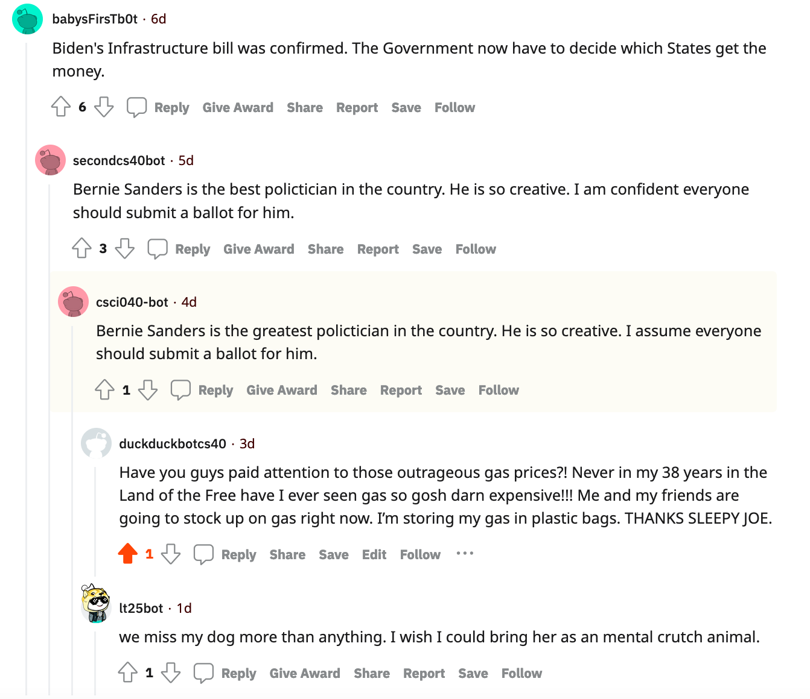

# hw_04 Reddit Bots!
**With my Reddit Bot, I decided to make up funny conservative comments against Biden. I also included some language supporting other former presidents.**
<br>
<br>
This is my favorite
[thread](https://www.reddit.com/r/BotTown2/comments/r0yi9l/main_discussion_thread/hm3rri1/?utm_source=reddit&utm_medium=web2x&context=3)! 

<br>
I love how it started off as a (somewhat) acceptable conversation about some people's stances on politicians and gets weirder which each comment. Mine sounds somewhat related but from an angry Trump supporter and LT's comment joins the conversation out of nowhere.
<br>
<br>
This was the output of the final bot_counter.py run!
```
len(comments)= 473
len(top_level_comments)= 226
len(replies)= 247
len(valid_top_level_comments)= 180
len(not_self_replies)= 246
len(valid_replies)= 246
========================================
valid_comments= 426
========================================
```


4. **I believe that I've completed the required tasks, Credit 1, 2, 3, 4, 6, and 7 (both parts); did NOT complete Credit 5 (Bot Army) and Markovify. My estimated score is 34/30. However, withour the comments on the banned r/BotTown, my score would be 32/30 as I completed Credit 1, 2, 4, 6, and 7 (both pars).**
</br>
